# SkillSwap — Feature Design & Architecture

> This document is the **feature design source of truth** for SkillSwap. It defines data models, edge function contracts, RLS policies, and the frontend page inventory. For technical conventions, coding standards, and development workflows, refer to [`agent.md`](../agent.md).

---

## 1. Project Summary

**SkillSwap** connects students on the same campus by their complementary skills. Students declare what they can teach and what they want to learn, then get matched into learning sessions — earning points, badges, and peer recognition along the way.

### Functional Pillars

| # | Pillar | Description |
|---|--------|-------------|
| 1 | Student Profile | Skills, levels, availabilities, campus, courses, friends |
| 2 | Matching System | Algorithm-driven suggestions + manual search/filter |
| 3 | Session Management | Plan and attend workshops, quick courses, thematic clubs |
| 4 | Gamification | Badges, points, challenges, leaderboard |
| 5 | Social Feed | Achievements, recommendations, peer feedback |
| 6 | Notifications | In-app notification system |
| 7 | Admin Console | User management, moderation, lookup CRUD, broadcast |

---

## 2. Entity Relationship Overview

```mermaid
erDiagram
    users ||--o{ users_skills : has
    users ||--o{ users_courses : enrolls
    users ||--o{ users_campuses : belongs_to
    users ||--o{ users_availabilities : declares
    users ||--o| user_roles : assigned
    users }o--o| academic_levels : references

    users_skills }o--|| skills : references
    users_courses }o--|| courses : references
    users_campuses }o--|| campuses : references

    users ||--o{ friend_requests : sends
    users ||--o{ friend_pairs : connected

    users ||--o{ match_requests : initiates
    match_requests ||--o| match_history : resolves
    match_requests }o--|| skills : for_skill

    users ||--o{ sessions : organizes
    sessions }o--|| session_types : categorized_by
    sessions }o--o| skills : teaches
    sessions }o--o| campuses : located_at
    sessions ||--o{ session_participants : includes

    users ||--o{ user_badges : earns
    user_badges }o--|| badges : references
    users ||--o{ user_points_ledger : accumulates
    user_points_ledger }o--|| point_actions : triggered_by
    users ||--o{ user_challenges : attempts
    user_challenges }o--|| challenges : tracks
    challenges }o--o| badges : rewards

    users ||--o{ posts : authors
    posts ||--o{ post_likes : receives
    posts ||--o{ post_comments : has
    posts ||--o{ post_shares : shared_as
    posts }o--o| sessions : references

    users ||--o{ notifications : receives
    users ||--o{ content_reports : submits
```

---

## 3. Feature Area: Student Profile [DONE]

### Tables

#### `users`

| Column | Type | Constraints | Description |
|--------|------|-------------|-------------|
| id | uuid | PK, default gen_random_uuid() | |
| auth_id | uuid | NOT NULL, UNIQUE, FK auth.users | Link to Supabase Auth |
| email | text | nullable | Synced from auth via trigger |
| first_name | text | nullable | |
| last_name | text | nullable | |
| phone | text | nullable | Synced from auth via trigger |
| academic_level_id | uuid | nullable, FK academic_levels | |
| suspended_at | timestamptz | nullable | Set by admin to suspend user |
| created_at | timestamptz | NOT NULL, default now() | |
| updated_at | timestamptz | NOT NULL, default now() | |

#### `academic_levels`

| Column | Type | Constraints | Description |
|--------|------|-------------|-------------|
| id | uuid | PK | |
| name_fr | text | NOT NULL | French label |
| name_en | text | nullable | English label |
| created_at | timestamptz | NOT NULL | |
| updated_at | timestamptz | NOT NULL | |

#### `skills`

| Column | Type | Constraints | Description |
|--------|------|-------------|-------------|
| id | uuid | PK | |
| name_fr | text | NOT NULL | French label |
| name_en | text | nullable | English label |
| created_at | timestamptz | NOT NULL | |
| updated_at | timestamptz | NOT NULL | |

#### `courses`

| Column | Type | Constraints | Description |
|--------|------|-------------|-------------|
| id | uuid | PK | |
| name_fr | text | NOT NULL | French label |
| name_en | text | nullable | English label |
| created_at | timestamptz | NOT NULL | |
| updated_at | timestamptz | NOT NULL | |

#### `campuses`

| Column | Type | Constraints | Description |
|--------|------|-------------|-------------|
| id | uuid | PK | |
| name_fr | text | NOT NULL | French label |
| name_en | text | nullable | English label |
| created_at | timestamptz | NOT NULL | |
| updated_at | timestamptz | NOT NULL | |

#### `users_skills`

| Column | Type | Constraints | Description |
|--------|------|-------------|-------------|
| id | uuid | PK | |
| user_id | uuid | NOT NULL, FK users | |
| skill_id | uuid | NOT NULL, FK skills | |
| user_skill_level | integer | NOT NULL, CHECK (1-5) | 1-2 = wants to learn, 3 = can pair, 4-5 = can teach |
| user_skill_description | text | nullable | Free-text context about proficiency |
| created_at | timestamptz | NOT NULL | |
| updated_at | timestamptz | NOT NULL | |

- UNIQUE(user_id, skill_id)

#### `users_courses`

| Column | Type | Constraints | Description |
|--------|------|-------------|-------------|
| id | uuid | PK | |
| user_id | uuid | NOT NULL, FK users | |
| class_id | uuid | NOT NULL, FK courses | |
| start_date | date | nullable | |
| end_date | date | nullable | |
| created_at | timestamptz | NOT NULL | |
| updated_at | timestamptz | NOT NULL | |

#### `users_campuses`

| Column | Type | Constraints | Description |
|--------|------|-------------|-------------|
| id | uuid | PK | |
| user_id | uuid | NOT NULL, FK users | |
| campus_id | uuid | NOT NULL, FK campuses | |
| created_at | timestamptz | NOT NULL | |
| updated_at | timestamptz | NOT NULL | |

#### `users_availabilities`

| Column | Type | Constraints | Description |
|--------|------|-------------|-------------|
| id | uuid | PK | |
| user_id | uuid | NOT NULL, FK users | |
| start_timestamp | timestamptz | NOT NULL | Availability window start |
| end_timestamp | timestamptz | NOT NULL | Availability window end |
| recurring_days | week_day_type[] | nullable | If set, slot recurs on these days |
| created_at | timestamptz | NOT NULL | |
| updated_at | timestamptz | NOT NULL | |

#### `friend_requests`

| Column | Type | Constraints | Description |
|--------|------|-------------|-------------|
| id | uuid | PK | |
| requestor_user_id | uuid | NOT NULL, FK users | Who sent the request |
| receiver_user_id | uuid | NOT NULL, FK users | Who receives the request |
| created_at | timestamptz | NOT NULL | |
| updated_at | timestamptz | NOT NULL | |

#### `friend_pairs`

| Column | Type | Constraints | Description |
|--------|------|-------------|-------------|
| id | uuid | PK | |
| requestor_user_id | uuid | NOT NULL, FK users | Original requester |
| receiver_user_id | uuid | NOT NULL, FK users | Who accepted |
| created_at | timestamptz | NOT NULL | |
| updated_at | timestamptz | NOT NULL | |

#### `user_roles`

| Column | Type | Constraints | Description |
|--------|------|-------------|-------------|
| id | uuid | PK | |
| user_id | uuid | NOT NULL, FK users, UNIQUE | |
| auth_id | uuid | NOT NULL | |
| role | user_roles_type | NOT NULL, default 'USER' | |
| created_at | timestamptz | NOT NULL | |
| updated_at | timestamptz | NOT NULL | |

### Enums (Profile Domain)

| Enum | Values |
|------|--------|
| `user_roles_type` | USER, ADMIN |
| `week_day_type` | MONDAY, TUESDAY, WEDNESDAY, THURSDAY, FRIDAY, SATURDAY, SUNDAY |

### Helper Functions

| Function | Purpose |
|----------|---------|
| `enforce_table_timestamps()` | Trigger: auto-sets `created_at` on INSERT, `updated_at` on UPDATE. Prevents `created_at` modification. |
| `handle_new_user()` | Trigger on `auth.users` INSERT: creates `public.users` row + default `USER` role in `user_roles`. |
| `handle_user_update()` | Trigger on `auth.users` UPDATE: syncs email and phone to `public.users`. |
| `is_user_admin()` | Returns true if current authenticated user has `ADMIN` role. |

### RLS (Profile Domain)

- All tables have RLS enabled.
- Users can read/update their own rows (scoped via `auth_id = auth.uid()` or subquery on `users`).
- Lookup tables (`academic_levels`, `skills`, `courses`, `campuses`) are readable by all authenticated users.
- Admins have full access on every table via `is_user_admin()`.

---

## 4. Feature Area: Matching System [TO BUILD]

### Design Decisions

- **Dual approach**: algorithm-driven suggestions AND manual search/filter.
- **Full history**: all match interactions are tracked (accepted, rejected, completed).
- **Skill level implies direction**: user_skill_level 4-5 = can teach, 1-2 = wants to learn, 3 = peer pairing.

### Tables

#### `match_requests`

Records a match attempt from one user to another for a specific skill.

| Column | Type | Constraints | Description |
|--------|------|-------------|-------------|
| id | uuid | PK | |
| requestor_user_id | uuid | NOT NULL, FK users | Who initiates the match |
| target_user_id | uuid | NOT NULL, FK users | Who is being matched with |
| skill_id | uuid | NOT NULL, FK skills | The skill in question |
| status | match_request_status_type | NOT NULL, default 'PENDING' | Current state |
| message | text | nullable | Optional intro message |
| created_at | timestamptz | NOT NULL | |
| updated_at | timestamptz | NOT NULL | |

#### `match_history`

Records completed/resolved match interactions for analytics and feedback.

| Column | Type | Constraints | Description |
|--------|------|-------------|-------------|
| id | uuid | PK | |
| match_request_id | uuid | NOT NULL, FK match_requests | Link to original request |
| requestor_user_id | uuid | NOT NULL, FK users | |
| target_user_id | uuid | NOT NULL, FK users | |
| skill_id | uuid | NOT NULL, FK skills | |
| outcome | match_outcome_type | NOT NULL | How the match resolved |
| rating | smallint | nullable, CHECK (1-5) | Post-match rating |
| feedback | text | nullable | Post-match feedback |
| created_at | timestamptz | NOT NULL | |
| updated_at | timestamptz | NOT NULL | |

### Enums

| Enum | Values |
|------|--------|
| `match_request_status_type` | PENDING, ACCEPTED, REJECTED, CANCELLED |
| `match_outcome_type` | COMPLETED, EXPIRED, WITHDRAWN |

### Edge Function: `match-students`

| Property | Detail |
|----------|--------|
| **Trigger** | Called by frontend matching page |
| **Input** | `user_id`, optional filters: `skill_id`, `campus_id`, `availability_overlap`, `level_range` |
| **Logic** | Queries `users_skills` for complementary levels (high-level users paired with low-level users on the same skill). Filters by shared campus, overlapping availability windows. Ranks by match quality score. |
| **Output** | Array of suggested user profiles with: `user_id`, `skill_id`, `user_skill_level`, `match_score`, `shared_campus`, `availability_overlap_hours` |

### RLS

- Users can view/create their own `match_requests`.
- Both parties (requestor + target) can view a shared match request.
- Users can view their own `match_history` entries.
- Admins have full access.

---

## 5. Feature Area: Session Management [TO BUILD]

### Design Decisions

- **Session types as lookup table**: extensible (admins can add new types without code changes).
- **Lifecycle enum**: PLANNED, IN_PROGRESS, COMPLETED, CANCELLED.
- **Participants have roles**: ORGANIZER, TEACHER, LEARNER.

### Tables

#### `session_types`

Extensible lookup table for session categories (like skills/campuses).

| Column | Type | Constraints | Description |
|--------|------|-------------|-------------|
| id | uuid | PK | |
| name_fr | text | NOT NULL | French label |
| name_en | text | nullable | English label |
| description_fr | text | nullable | French description |
| description_en | text | nullable | English description |
| created_at | timestamptz | NOT NULL | |
| updated_at | timestamptz | NOT NULL | |

**Seed data:** "Atelier" / "Workshop", "Cours rapide" / "Quick Course", "Club thématique" / "Thematic Club"

#### `sessions`

A scheduled learning session.

| Column | Type | Constraints | Description |
|--------|------|-------------|-------------|
| id | uuid | PK | |
| session_type_id | uuid | NOT NULL, FK session_types | Category of session |
| skill_id | uuid | NOT NULL, FK skills | Skill being taught/practiced |
| organizer_user_id | uuid | NOT NULL, FK users | Who created the session |
| title | text | NOT NULL | Session title |
| description | text | nullable | Detailed description |
| status | session_status_type | NOT NULL, default 'PLANNED' | Lifecycle state |
| max_participants | smallint | nullable | null = unlimited |
| location | text | nullable | Physical or virtual location |
| start_timestamp | timestamptz | NOT NULL | Scheduled start |
| end_timestamp | timestamptz | NOT NULL | Scheduled end |
| campus_id | uuid | nullable, FK campuses | Where (if campus-specific) |
| created_at | timestamptz | NOT NULL | |
| updated_at | timestamptz | NOT NULL | |

#### `session_participants`

Join table tracking who attends each session and in what role.

| Column | Type | Constraints | Description |
|--------|------|-------------|-------------|
| id | uuid | PK | |
| session_id | uuid | NOT NULL, FK sessions | |
| user_id | uuid | NOT NULL, FK users | |
| role | session_participant_role_type | NOT NULL | Participant's role |
| joined_at | timestamptz | NOT NULL, default now() | When they joined |
| created_at | timestamptz | NOT NULL | |
| updated_at | timestamptz | NOT NULL | |

- UNIQUE(session_id, user_id)

### Enums

| Enum | Values |
|------|--------|
| `session_status_type` | PLANNED, IN_PROGRESS, COMPLETED, CANCELLED |
| `session_participant_role_type` | ORGANIZER, TEACHER, LEARNER |

### RLS

- Organizer can CRUD their own sessions.
- All authenticated users can SELECT sessions (for browsing/discovery).
- Participants can view sessions they joined.
- Only participants or the organizer can modify `session_participants` for their session.
- Admins have full access.

---

## 6. Feature Area: Gamification [TO BUILD]

### Design Decisions

- **Badges**: auto-awarded based on rules defined in edge functions.
- **Points**: earned per action, accumulated in an append-only ledger. Total points = SUM of ledger entries.
- **Challenges**: system-defined quests with progress tracking.

### Tables

#### `badges`

Lookup table of all available badges.

| Column | Type | Constraints | Description |
|--------|------|-------------|-------------|
| id | uuid | PK | |
| name_fr | text | NOT NULL | French badge name |
| name_en | text | nullable | English badge name |
| description_fr | text | nullable | French description |
| description_en | text | nullable | English description |
| icon_url | text | nullable | Badge icon asset URL |
| criteria_description | text | nullable | Human-readable unlock condition |
| points_reward | integer | NOT NULL, default 0 | Points granted when badge is earned |
| created_at | timestamptz | NOT NULL | |
| updated_at | timestamptz | NOT NULL | |

#### `user_badges`

Tracks which badges a user has earned.

| Column | Type | Constraints | Description |
|--------|------|-------------|-------------|
| id | uuid | PK | |
| user_id | uuid | NOT NULL, FK users | |
| badge_id | uuid | NOT NULL, FK badges | |
| awarded_at | timestamptz | NOT NULL, default now() | When the badge was earned |
| created_at | timestamptz | NOT NULL | |
| updated_at | timestamptz | NOT NULL | |

- UNIQUE(user_id, badge_id) — a badge can only be earned once per user.

#### `point_actions`

Lookup table defining how many points each type of action awards.

| Column | Type | Constraints | Description |
|--------|------|-------------|-------------|
| id | uuid | PK | |
| action_key | text | NOT NULL, UNIQUE | Machine identifier (e.g. `session_completed_as_teacher`) |
| name_fr | text | NOT NULL | French label |
| name_en | text | nullable | English label |
| points_value | integer | NOT NULL | Points awarded per occurrence |
| created_at | timestamptz | NOT NULL | |
| updated_at | timestamptz | NOT NULL | |

#### `user_points_ledger`

Append-only log of all points earned. Total user points = SUM(points_earned) WHERE user_id = X.

| Column | Type | Constraints | Description |
|--------|------|-------------|-------------|
| id | uuid | PK | |
| user_id | uuid | NOT NULL, FK users | |
| point_action_id | uuid | NOT NULL, FK point_actions | Which action triggered this |
| points_earned | integer | NOT NULL | Points awarded (always positive) |
| reference_id | uuid | nullable | Polymorphic link to the triggering entity |
| created_at | timestamptz | NOT NULL | |

#### `challenges`

System-defined challenges (quests) that users can complete for rewards.

| Column | Type | Constraints | Description |
|--------|------|-------------|-------------|
| id | uuid | PK | |
| name_fr | text | NOT NULL | French name |
| name_en | text | nullable | English name |
| description_fr | text | nullable | French description |
| description_en | text | nullable | English description |
| goal_type | text | NOT NULL | Machine key for what to count (e.g. `complete_sessions`) |
| goal_count | integer | NOT NULL | How many to reach goal |
| points_reward | integer | NOT NULL, default 0 | Points awarded on completion |
| badge_reward_id | uuid | nullable, FK badges | Badge awarded on completion |
| start_date | date | nullable | Challenge availability start (null = always) |
| end_date | date | nullable | Challenge availability end (null = no expiry) |
| created_at | timestamptz | NOT NULL | |
| updated_at | timestamptz | NOT NULL | |

#### `user_challenges`

Tracks individual user progress toward each challenge.

| Column | Type | Constraints | Description |
|--------|------|-------------|-------------|
| id | uuid | PK | |
| user_id | uuid | NOT NULL, FK users | |
| challenge_id | uuid | NOT NULL, FK challenges | |
| current_progress | integer | NOT NULL, default 0 | Current count toward goal |
| status | challenge_status_type | NOT NULL, default 'IN_PROGRESS' | |
| completed_at | timestamptz | nullable | When the challenge was completed |
| created_at | timestamptz | NOT NULL | |
| updated_at | timestamptz | NOT NULL | |

- UNIQUE(user_id, challenge_id)

### Enums

| Enum | Values |
|------|--------|
| `challenge_status_type` | IN_PROGRESS, COMPLETED, FAILED, EXPIRED |

### Edge Function: `award-points`

| Property | Detail |
|----------|--------|
| **Trigger** | Called after relevant actions (session completed, challenge completed, etc.) |
| **Input** | `user_id`, `action_key`, `reference_id` (optional) |
| **Logic** | Looks up `point_actions` by `action_key`, inserts into `user_points_ledger`. Then calls `check-badge-criteria` and increments relevant `user_challenges` progress. |
| **Output** | `{ points_earned, total_points, badges_awarded[], challenges_completed[] }` |

### Edge Function: `check-badge-criteria`

| Property | Detail |
|----------|--------|
| **Trigger** | Called by `award-points` after each point award |
| **Input** | `user_id` |
| **Logic** | Evaluates all badge criteria rules against user's activity (total sessions, points milestones, etc.). Awards any newly-met badges by inserting into `user_badges`. |
| **Output** | `{ newly_awarded_badges[] }` |

### RLS

- Users can view their own points/badges/challenges.
- Leaderboard data (aggregated points per user) readable by all authenticated users.
- Lookup tables (`badges`, `point_actions`, `challenges`) readable by all authenticated users.
- Only edge functions (via service role) can INSERT into `user_points_ledger` and `user_badges`.
- Admins have full access.

---

## 7. Feature Area: Social Feed [TO BUILD]

### Design Decisions

- **Single posts table** with a `visibility` field (PUBLIC, FRIENDS_ONLY).
- **3 post types**: ACHIEVEMENT, RECOMMENDATION, FEEDBACK.
- **Interactions**: Like + Comment + Share/Repost.

### Tables

#### `posts`

Social feed posts.

| Column | Type | Constraints | Description |
|--------|------|-------------|-------------|
| id | uuid | PK | |
| author_user_id | uuid | NOT NULL, FK users | Post author |
| post_type | post_type | NOT NULL | Category of post |
| visibility | post_visibility_type | NOT NULL, default 'PUBLIC' | Who can see it |
| title | text | nullable | Optional post title |
| content | text | NOT NULL | Post body |
| media_url | text | nullable | Attached media (image/video URL) |
| referenced_user_ids | uuid[] | nullable | Tagged users |
| referenced_session_id | uuid | nullable, FK sessions | Linked session (if relevant) |
| created_at | timestamptz | NOT NULL | |
| updated_at | timestamptz | NOT NULL | |

#### `post_likes`

| Column | Type | Constraints | Description |
|--------|------|-------------|-------------|
| id | uuid | PK | |
| post_id | uuid | NOT NULL, FK posts ON DELETE CASCADE | |
| user_id | uuid | NOT NULL, FK users | Who liked |
| created_at | timestamptz | NOT NULL | |

- UNIQUE(post_id, user_id) — one like per user per post.

#### `post_comments`

| Column | Type | Constraints | Description |
|--------|------|-------------|-------------|
| id | uuid | PK | |
| post_id | uuid | NOT NULL, FK posts ON DELETE CASCADE | |
| author_user_id | uuid | NOT NULL, FK users | Comment author |
| content | text | NOT NULL | Comment body |
| created_at | timestamptz | NOT NULL | |
| updated_at | timestamptz | NOT NULL | |

#### `post_shares`

| Column | Type | Constraints | Description |
|--------|------|-------------|-------------|
| id | uuid | PK | |
| original_post_id | uuid | NOT NULL, FK posts ON DELETE CASCADE | The post being shared |
| sharing_user_id | uuid | NOT NULL, FK users | Who shared it |
| comment | text | nullable | Optional share commentary |
| created_at | timestamptz | NOT NULL | |

### Enums

| Enum | Values |
|------|--------|
| `post_type` | ACHIEVEMENT, RECOMMENDATION, FEEDBACK |
| `post_visibility_type` | PUBLIC, FRIENDS_ONLY |

### RLS

- **PUBLIC** posts: readable by all authenticated users.
- **FRIENDS_ONLY** posts: readable only by the author's friends (resolved via `friend_pairs` where either `requestor_user_id` or `receiver_user_id` matches the current user AND the other side matches the post author).
- Users can INSERT/UPDATE/DELETE their own posts, likes, comments, and shares.
- Admins have full access.

---

## 8. Feature Area: Notifications [TO BUILD]

### Tables

#### `notifications`

In-app notification system. Notifications are created by edge functions or triggers and consumed by the frontend.

| Column | Type | Constraints | Description |
|--------|------|-------------|-------------|
| id | uuid | PK | |
| recipient_user_id | uuid | NOT NULL, FK users | Who receives the notification |
| sender_user_id | uuid | nullable, FK users | Who triggered it (null for system) |
| notification_type | notification_type | NOT NULL | Category |
| title_key | text | NOT NULL | i18n translation key for title |
| body_key | text | NOT NULL | i18n translation key for body |
| reference_id | uuid | nullable | Polymorphic link to relevant entity |
| reference_type | text | nullable | Entity type (e.g. 'match_request', 'session', 'badge', 'post') |
| is_read | boolean | NOT NULL, default false | Read state |
| created_at | timestamptz | NOT NULL | |

### Enums

| Enum | Values |
|------|--------|
| `notification_type` | MATCH_REQUEST, MATCH_ACCEPTED, SESSION_INVITE, SESSION_REMINDER, BADGE_EARNED, CHALLENGE_COMPLETED, FRIEND_REQUEST, POST_LIKE, POST_COMMENT, POST_SHARE, ADMIN_BROADCAST, ACCOUNT_SUSPENDED, CONTENT_REMOVED |

### RLS

- Users can only SELECT/UPDATE (mark as read) their own notifications.
- Only edge functions (via service role) or admin can INSERT notifications.
- Admins have full access.

---

## 9. Feature Area: Admin Console [TO BUILD]

### Design Decisions

- Lives within the same Next.js app under a `/admin` route group.
- Protected by middleware: only users with `ADMIN` role (via `is_user_admin()`) can access.
- Route group: `src/app/[locale]/(admin)/admin/...`

### Capabilities

#### 1. User Management (`/admin/users`)

- View all users (paginated, searchable, filterable by campus/role/status)
- View user detail (profile, activity, sessions, points)
- Edit user roles (promote to ADMIN, demote to USER)
- Suspend/ban users (sets `suspended_at` on `users` table)
- Delete users

#### 2. Content Moderation (`/admin/moderation`)

- View reported/flagged posts and comments
- Remove posts or comments
- Warn or suspend offending users

#### 3. Lookup Table Management (`/admin/lookups`)

- CRUD for: skills, courses, campuses, academic_levels, session_types
- Bilingual fields (name_fr, name_en) editable inline

#### 4. Session Oversight (`/admin/sessions`)

- View all sessions (filterable by status, type, date)
- Cancel sessions
- Manage disputes between participants

#### 5. Gamification Management (`/admin/gamification`)

- CRUD for badges (name, description, icon, criteria, points reward)
- CRUD for challenges (name, description, goals, rewards, date range)
- CRUD for point_actions (action keys, point values)
- View leaderboard

#### 6. Broadcast Notifications (`/admin/notifications`)

- Send announcements to all users or filtered groups (by campus, course, role)
- View sent broadcast history

### Tables

#### `content_reports`

User-submitted reports on posts or comments for moderation review.

| Column | Type | Constraints | Description |
|--------|------|-------------|-------------|
| id | uuid | PK | |
| reporter_user_id | uuid | NOT NULL, FK users | Who submitted the report |
| reported_entity_id | uuid | NOT NULL | ID of the reported post or comment |
| reported_entity_type | text | NOT NULL | 'post' or 'comment' |
| reason | text | NOT NULL | Why it was reported |
| status | report_status_type | NOT NULL, default 'PENDING' | Moderation state |
| resolved_by_user_id | uuid | nullable, FK users | Admin who resolved it |
| resolution_note | text | nullable | Admin's resolution note |
| created_at | timestamptz | NOT NULL | |
| updated_at | timestamptz | NOT NULL | |

### Enums

| Enum | Values |
|------|--------|
| `report_status_type` | PENDING, RESOLVED, DISMISSED |

### RLS

- Authenticated users can INSERT their own reports (to flag content).
- Only admins (via `is_user_admin()`) can SELECT/UPDATE `content_reports`.
- All admin console operations are gated by `is_user_admin()`.

---

## 10. Frontend Page Inventory

### Public (Unauthenticated) Pages

| Route | Purpose | Status |
|-------|---------|--------|
| `/login` | Sign in | DONE |
| `/register` | Create account | DONE |
| `/verify-email` | Post-registration email confirmation | DONE |
| `/privacy-policy` | Privacy policy (static) | TO BUILD |
| `/terms-of-service` | Terms of service (static) | TO BUILD |
| `/legal-notice` | Legal notice (static) | TO BUILD |
| `/accessibility` | Accessibility statement (static) | TO BUILD |
| `/contact` | Contact form | TO BUILD |
| `/about` | Project description | TO BUILD |
| `/faq` | Frequently asked questions | TO BUILD |

### Authenticated Pages

| Route | Purpose | Status |
|-------|---------|--------|
| `/` | Home dashboard (activity feed, quick stats, upcoming sessions) | TO BUILD |
| `/profile/:uuid` | User profile (skills, availabilities, badges, stats) | TO BUILD |
| `/profile/edit` | Edit own profile | TO BUILD |
| `/matching` | Skill matching hub (search + algorithm suggestions) | TO BUILD |
| `/sessions` | Browse/manage sessions | TO BUILD |
| `/sessions/:uuid` | Session detail | TO BUILD |
| `/sessions/create` | Create new session | TO BUILD |
| `/feed` | Social feed (global + friends filter) | TO BUILD |
| `/challenges` | Active challenges + progress | TO BUILD |
| `/leaderboard` | Points ranking | TO BUILD |
| `/notifications` | Notification center | TO BUILD |
| `/friends` | Friend list + requests | TO BUILD |
| `/campus/:uuid` | Campus detail page | TO BUILD |
| `/courses/:uuid` | Course detail page | TO BUILD |

### Admin Pages (ADMIN Role Required)

| Route | Purpose | Status |
|-------|---------|--------|
| `/admin` | Admin dashboard overview | TO BUILD |
| `/admin/users` | User management (list, search, filter) | TO BUILD |
| `/admin/users/:uuid` | User detail + actions (edit role, suspend, delete) | TO BUILD |
| `/admin/moderation` | Content reports queue | TO BUILD |
| `/admin/lookups` | Lookup tables management | TO BUILD |
| `/admin/sessions` | Session oversight | TO BUILD |
| `/admin/gamification` | Badges, challenges, point actions management | TO BUILD |
| `/admin/notifications` | Broadcast notification tool | TO BUILD |

---

## 11. Implementation Status Summary

| Feature Area | Backend (DB) | Backend (Edge Functions) | Frontend |
|--------------|:------------:|:------------------------:|:--------:|
| Student Profile | DONE | N/A | TO BUILD (profile page) |
| Matching System | TO BUILD | TO BUILD (`match-students`) | TO BUILD |
| Session Management | TO BUILD | N/A | TO BUILD |
| Gamification | TO BUILD | TO BUILD (`award-points`, `check-badge-criteria`) | TO BUILD |
| Social Feed | TO BUILD | N/A | TO BUILD |
| Notifications | TO BUILD | N/A | TO BUILD |
| Admin Console | TO BUILD | N/A | TO BUILD |
| Auth Flow | DONE | N/A | DONE |

---

## 12. Key Design Rationale

| Decision | Rationale |
|----------|-----------|
| Skill level implies direction | `user_skill_level` (1-5) determines teach/learn matching without an explicit direction field. 4-5 = can teach, 1-2 = wants to learn, 3 = peer pairing. |
| Session types as lookup table | Allows admins to add new session types via the admin console without code changes (unlike a PostgreSQL enum). |
| Append-only points ledger | Enables full auditability and recalculation. Total points are derived via `SUM(points_earned)` aggregate. |
| Single posts table with visibility | Simpler than two separate feed tables. The friends-only filter is a query-time concern resolved via `friend_pairs`. |
| Notifications use i18n keys | `title_key`/`body_key` reference translation keys rather than storing localized strings, keeping the system language-agnostic. |
| Content reports for moderation | Rather than admin manually scanning, users flag content. Admins review a queue. |
| `suspended_at` on users | A nullable timestamp is simpler than a status enum — null = active, set = suspended. Easily queryable. |

---

## 13. All Enums (Complete Reference)

| Enum | Values | Domain |
|------|--------|--------|
| `user_roles_type` | USER, ADMIN | Profile |
| `week_day_type` | MONDAY, TUESDAY, WEDNESDAY, THURSDAY, FRIDAY, SATURDAY, SUNDAY | Profile |
| `match_request_status_type` | PENDING, ACCEPTED, REJECTED, CANCELLED | Matching |
| `match_outcome_type` | COMPLETED, EXPIRED, WITHDRAWN | Matching |
| `session_status_type` | PLANNED, IN_PROGRESS, COMPLETED, CANCELLED | Sessions |
| `session_participant_role_type` | ORGANIZER, TEACHER, LEARNER | Sessions |
| `challenge_status_type` | IN_PROGRESS, COMPLETED, FAILED, EXPIRED | Gamification |
| `post_type` | ACHIEVEMENT, RECOMMENDATION, FEEDBACK | Social Feed |
| `post_visibility_type` | PUBLIC, FRIENDS_ONLY | Social Feed |
| `notification_type` | MATCH_REQUEST, MATCH_ACCEPTED, SESSION_INVITE, SESSION_REMINDER, BADGE_EARNED, CHALLENGE_COMPLETED, FRIEND_REQUEST, POST_LIKE, POST_COMMENT, POST_SHARE, ADMIN_BROADCAST, ACCOUNT_SUSPENDED, CONTENT_REMOVED | Notifications |
| `report_status_type` | PENDING, RESOLVED, DISMISSED | Admin |

---

## 14. All Edge Functions (Complete Reference)

| Function | Domain | Trigger | Purpose |
|----------|--------|---------|---------|
| `match-students` | Matching | Frontend call | Compute and return ranked match suggestions for a user |
| `award-points` | Gamification | After qualifying actions | Insert points ledger entry, check badges, update challenge progress |
| `check-badge-criteria` | Gamification | Called by `award-points` | Evaluate badge rules and award newly-met badges |
